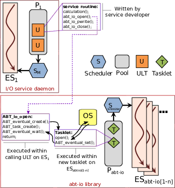

# abt-io

abt-io provides Argobots-aware wrappers to common POSIX I/O
functions.

Argobots (https://github.com/pmodels/argobots) is a threading package
that provides light-weight _non-preemptable_ user-level threads.  This
means that if an Argobots thread executes a blocking I/O system call
directly, it will block forward progress for all threads on that execution
stream until that blocking I/O system call completes.

The abt-io library addresses this problem by providing a set of wrapper
functions that delegate blocking I/O system calls to a dedicated set
of execution streams (i.e. pthreads) that perform the I/O operation on
behalf of the caller.  User level threads that invoke these wrappers
will yield control until the I/O operation completes, allowing other
user-level threads to continue execution.

If multiple I/O operations are issued at the same time, then they will make
progress concurrently according to the number of execution streams assigned
to abt-io.

This library is a companion to the Margo library (which provides similar
capability, but for the Mercury RPC library).  When used with Margo it
prevents RPC handlers (callbacks) from blocking on I/O operations, thereby
improving RPC throughput.

Margo: https://xgitlab.cels.anl.gov/sds/margo

##  Dependencies

* argobots (https://github.com/pmodels/argobots)

## Building Argobots (dependency)

Example configuration:

    ../configure --prefix=/home/pcarns/working/install

## Building

Example configuration:

    ../configure --prefix=/home/pcarns/working/install \
        PKG_CONFIG_PATH=/home/pcarns/working/install/lib/pkgconfig \
        CFLAGS="-g -Wall"

## Design details

abt-io provides Argobots-aware wrappers to common POSIX I/O functions
like open(), pwrite(), and close().  The wrappers behave identically to
their POSIX counterparts from a caller's point of view, but internally
they delegate blocking I/O system calls to a dedicated Argobots pool.
The caller is suspended until the system call completes so that other
concurrent ULTs can make progress in the mean time.

The delegation step is implemented by spawning a new tasklet that
coordinates with the calling ULT via an eventual construct. The tasklets
are allowed to block on system calls because they are executing on a
dedicated pool that has been designated for that purpose. This division
of responsibility between a request servicing pool and an I/O system
call servicing pool can be thought of as a form of I/O forwarding.

The use of multiple execution streams in the abt-io pool means that
multiple I/O operations can make asynchronous progress concurrently.
The caller can issue abt\_io calls from an arbitrary number of ULTs,
but the actual underying operations will be issued to the local file
system with a level of concurrency determined by the number of execution
streams in the abt-io pool.  This is similar to aio functionality but with a
simpler interface and less serialization.

Additional details and performance analysis can be found in
https://ieeexplore.ieee.org/document/8082139.
